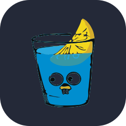

  
  &nbsp;&nbsp;&nbsp;&nbsp;
  

  

    <b>Hi 👋, I'm Nguyen Tien Khang</b>
  

  
<strong>🚀 Backend Developer & AI Researcher | LLMs • VLMs</strong>

  
☕ <b>Java • .NET • Golang • Python</b>

  
🎓 Software Engineering @ <strong>University of Information Technology (UIT - VNU-HCM)</strong>

  

### 👨‍💻 About Me

- 🔭 **Current Focus**: Designing high-performance backend systems, microservices & production-ready **LLM / VLM integrations**.
- 💡 **Research & Passions**: **Large Language Models (LLMs)**, **Vision-Language Models (VLMs)**, Multimodal AI, High Concurrency & System Design.
- 🌱 **Currently exploring**: RAG architectures, Multimodal reasoning, and high-throughput AI serving pipelines.
- 💼 **Experience**: Currently working as a **Full-time Backend Developer** (ex-SWE Intern).
- 🎯 **Goals**: Scaling high-throughput architectures, advancing LLM/VLM applications & open to impactful collaborations.

### 🛠️ Tech Stack

  

    
    
  

  

    
    
    
  

  

    
    
    
    
  

  

    
    
    
  

### 📊 GitHub Activity & Stats

  
  

  

  <h3>🌐 Connect With Me</h3>

  

    
    &nbsp;&nbsp;
    
    &nbsp;&nbsp;
    
  

